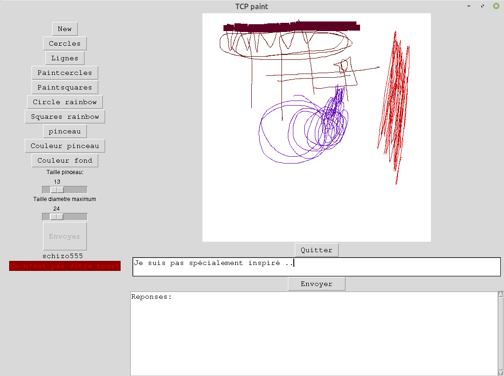
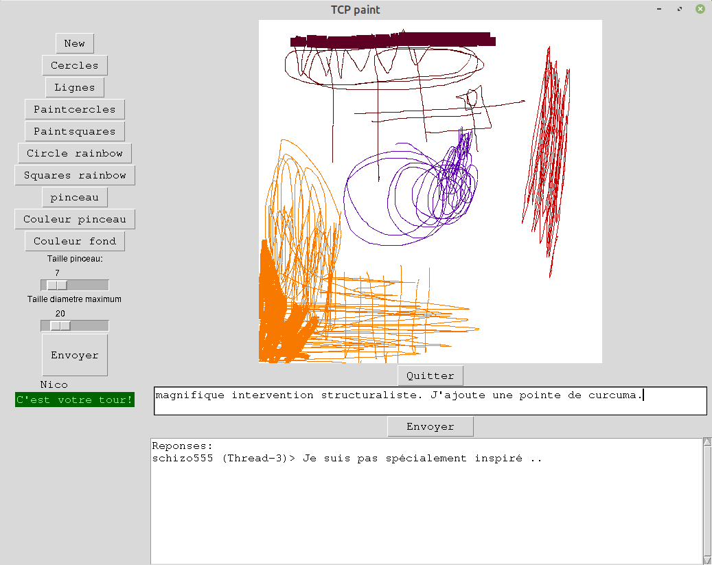
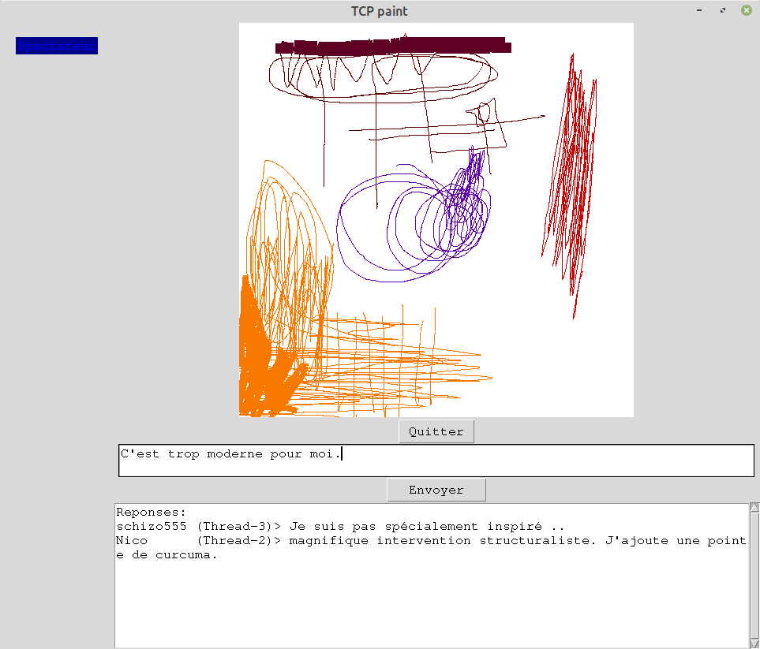

This little network painting game was made with **python 3.8.5**
To make those programs work you will need **pyscreenshot** installed
`pip install pyscreenshot`
should work. Once those two requirements installed the program works fine on **Ubuntu Ulyana** and **Fedora 32**
There can be some **problems** on **Mac Os** for the client, but the server works on this configuration.

launch server on a machine, specify machine name or IP and port :
`TCP_paint_server.py 192.168.1.17 55555`
launch client on same or other machine specify server machine name and port:
`TCP_paint_client.py 192.168.1.17 55555`

select 1 for new "paint game"
2 for joining existing game.
Server can support many clients.
Each new game has a "thread" name. If you wish to join game you have to specify the exact thread name as follow:
`Thread-2`

first round : The player made a drawing

second round: The second player answered

The Watcher: third player of a game can only watch
